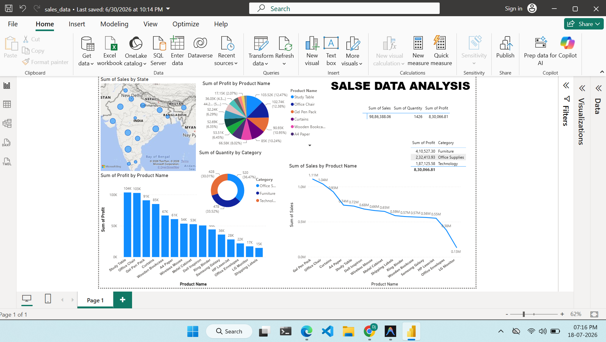
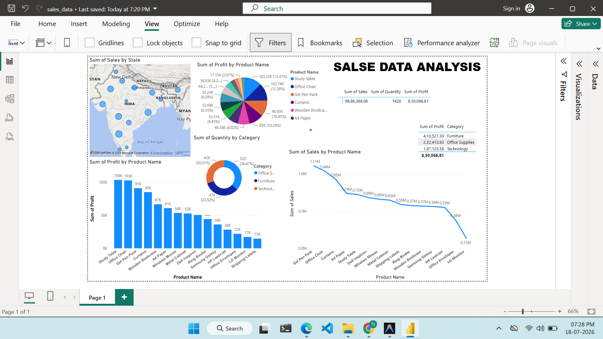

# 📊 Sales Performance Dashboard

## 📖 Project Overview
This project provides a comprehensive analysis of retail sales data (over 9,000 records) to uncover actionable business insights. Using a complete data analytics pipeline—from data cleaning and SQL querying to exploratory data analysis in Python and interactive visualization in Power BI—this project identifies top-performing products, high-value customers, and regional sales trends.

## 🎯 Key Objectives
- Clean and preprocess raw sales data for accuracy.
- Perform Exploratory Data Analysis (EDA) to uncover seasonal trends.
- Use SQL to extract performance metrics (top customers, profitable states, loss-making products).
- Design an interactive Power BI dashboard to present KPIs and profitability insights to stakeholders.

## 🛠️ Tools & Technologies
- **Data Management**: Excel / CSV
- **Database & Querying**: SQL
- **Data Analysis**: Python (Pandas, Matplotlib)
- **Data Visualization**: Power BI

## 📂 Repository Contents (Deliverables)
- **`Dataset/Superstore.csv`**: The cleaned dataset used for all analyses.
- **`SQL/analysis.sql`**: SQL scripts for aggregating data and extracting key business insights.
- **`sales_analysis.ipynb`**: Python Jupyter Notebook documenting the EDA process and visualizing seasonal trends.
- **`Sales_Dashboard.pbix`**: The interactive Power BI dashboard containing KPIs, trend analyses, and profitability breakdowns.
- **`Report.pdf`**: A summary report of the project findings.
- **`PowerBI/`**: Folder containing dashboard screenshots and related assets.

## 🔍 Key Insights & Findings
1. **Regional Performance**: Identified the most and least profitable states to help reallocate marketing budgets.
2. **Product Profitability**: Pinpointed specific loss-making products that require pricing adjustments or discontinuation.
3. **Seasonal Trends**: Uncovered peak sales months, allowing for better inventory planning.
4. **Customer Segmentation**: Highlighted the top 10 high-value customers driving a significant portion of total revenue.

## 🚀 How to Run the Project

### 1. SQL Analysis
- Load `Dataset/Superstore.csv` into your preferred SQL database (e.g., MySQL, PostgreSQL, SQL Server).
- Execute the queries provided in `SQL/analysis.sql` to view the aggregated metrics.

### 2. Python EDA
- Ensure you have Python installed along with Jupyter, Pandas, and Matplotlib.
- Run `pip install pandas matplotlib jupyter`
- Launch Jupyter Notebook and open `sales_analysis.ipynb`.
- Run all cells to see the data cleaning steps and visualizations.

### 3. Power BI Dashboard
- Download and install [Power BI Desktop](https://powerbi.microsoft.com/desktop/).
- Open `Sales_Dashboard.pbix`.
- Interact with the filters and visualizations to explore regional performance and profitability.

## 📈 Dashboard Screenshots

### Overview

### Regional & Profitability Insights

